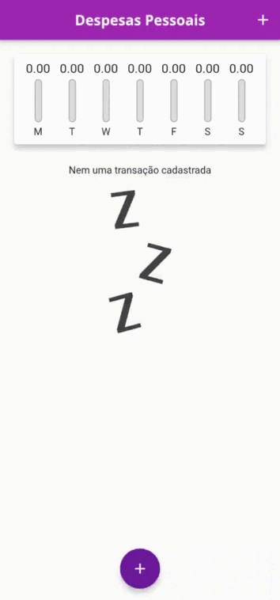

# 📊 ExpensesApp

Este é um projeto desenvolvido durante a aula prática do curso "Aprenda Flutter e Desenvolva Apps Para Android e IOS" da Cod3r, na sessão 4: Desenvolvendo Aplicativo Real - Despesas Pessoais.

## 💡 Sobre o Projeto

O ExpensesApp é um aplicativo de controle de despesas pessoais, onde o usuário pode registrar todas as suas despesas e visualizá-las em diferentes categorias. O aplicativo permite que o usuário adicione novas despesas, exclua despesas existentes e visualize um gráfico com o resumo das suas despesas.

O objetivo deste projeto é fornecer uma aplicação completa e funcional desenvolvida com a linguagem de programação Flutter, que é uma tecnologia cada vez mais utilizada no mercado de desenvolvimento de aplicativos móveis.
## 📱 Funcionalidades

- Adicionar novas despesas com data, categoria, título e valor;
- Excluir despesas existentes;
- Visualizar todas as despesas registradas em uma lista;
- Visualizar as despesas em diferentes categorias: alimentação, transporte, educação, entre outras;
- Visualizar um gráfico resumo das despesas registradas.
## 🎬 Tela do projeto

## 🚀 Tecnologias Utilizadas

- Flutter
- Dart

## 💻 Executando o Projeto

Para executar o projeto, siga as instruções abaixo:

1. Clone este repositório
2. Abra o terminal na pasta do projeto
3. Execute o comando `flutter pub get` para instalar as dependências
4. Conecte um dispositivo físico ou emulador Android/iOS
5. Execute o comando `flutter run` para rodar o aplicativo

## 📝 Observações

Este projeto é apenas para fins de estudo e desenvolvimento. O aplicativo pode conter bugs e não deve ser utilizado em ambiente de produção.
